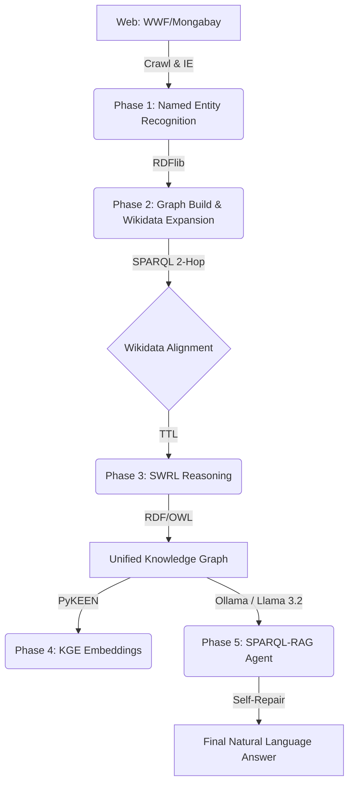
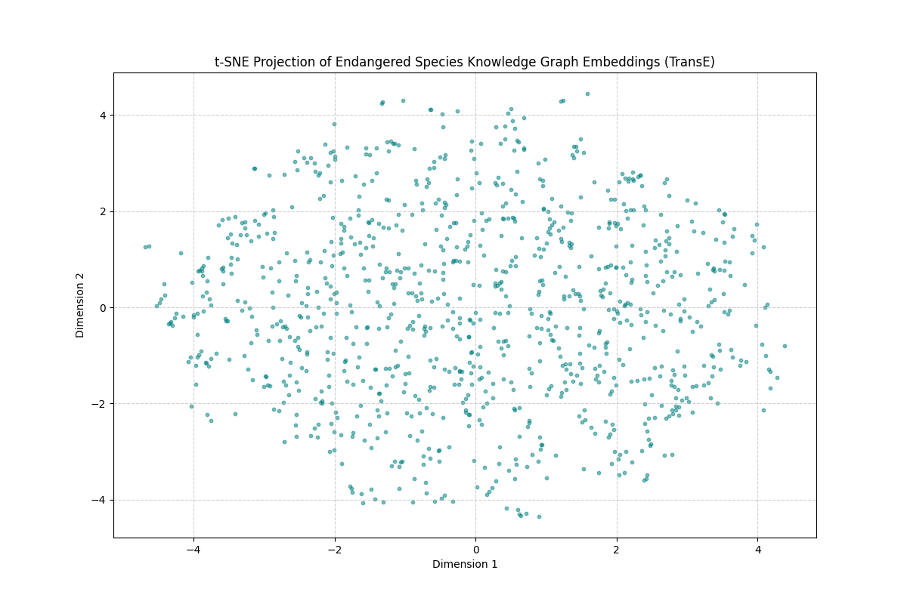

# 🌿 Endangered Species Knowledge Graph & RAG Pipeline 🤖

[](https://github.com/oviachane/endangered_species_kg)
[](https://www.u-paris.fr/)

This repository contains the complete implementation for the **Semantic Web & Knowledge Discovery** final project. It features an end-to-end automated pipeline transforming unstructured conservation news into a verified, reasoned, and queryable Knowledge Graph.

---

## 🏗️ System Architecture



---

## 🚀 Installation & Usage

### ⚙️ Prerequisites
1.  **Local AI Engine**: Install [Ollama](https://ollama.com/) and download the model:
    ```bash
    ollama pull llama3.2
    ```
2.  **Environment**:
    ```bash
    pip install -r requirements.txt
    ```

### 🛠️ Execution Pipeline
Follow the sequence below to rebuild the ecosystem:

| Phase | Description | Command |
| :--- | :--- | :--- |
| **1** | Web Crawling & NER | `python src/crawl/crawler.py` |
| **2** | KG Build & Wikidata Expand | `python src/kg/align_expand_wikidata.py` |
| **3** | SWRL Reasoning Logic | `python src/reason/swrl_kg.py` |
| **4** | KGE Model Training | `python src/kge/train_kge.py` |
| **4.5**| **KGE Latent Analysis** | `python src/kge/visualize_embeddings.py` |
| **5** | **Interactive RAG Chat** | `python src/rag/rag_pipeline.py` |

---

## 📊 Technical Specifications 

- **KB Statistics**: [kb_statistics.json](kg_artifacts/kb_statistics.json) (Triplets, Entities, Predicates).
- **Core Ontology**: [ontology.ttl](kg_artifacts/ontology.ttl) (Formal class definitions).
- **Reasoning Materialization**: Inferred relations stored in `graph_unified.ttl`.
- **KGE Reproducibility**: Dataset splits located in `data/kge_splits/`.

---

## 📸 Project Showcase

### RAG Agent SPARQL Self-Repair

*Figure: The system successfully translating "Find subjects that are Habitat" into a SPARQL query and correcting itself after a syntax error.*

### Embedding Latent Space (t-SNE)

*Figure: t-SNE clustering of the 50,000-triplet Knowledge Graph embeddings.*

---

*Project developed for the **Semantic Web & Web Data** Final Project (2025-2026).*
*Timothée JOLIOT & Ovia CHANEMOUGANANDAM*
